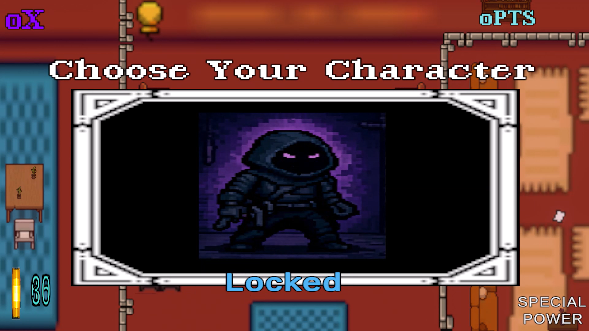
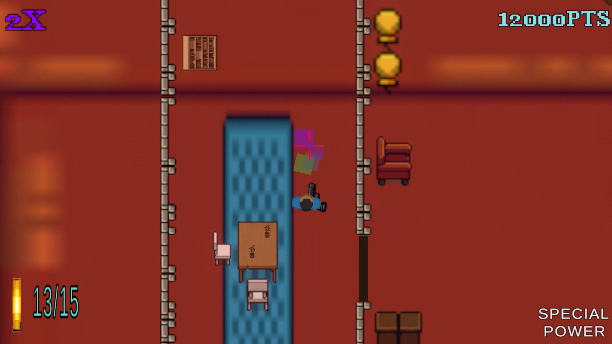
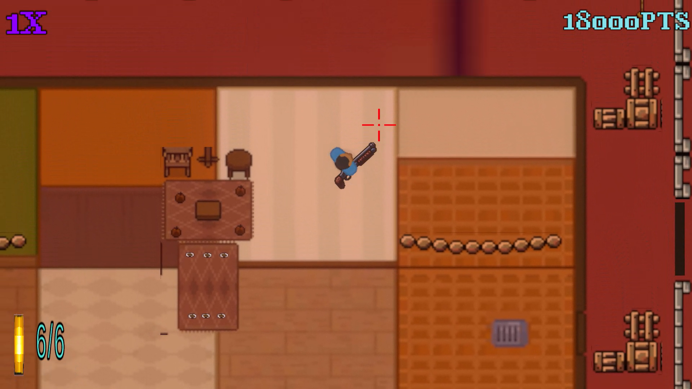
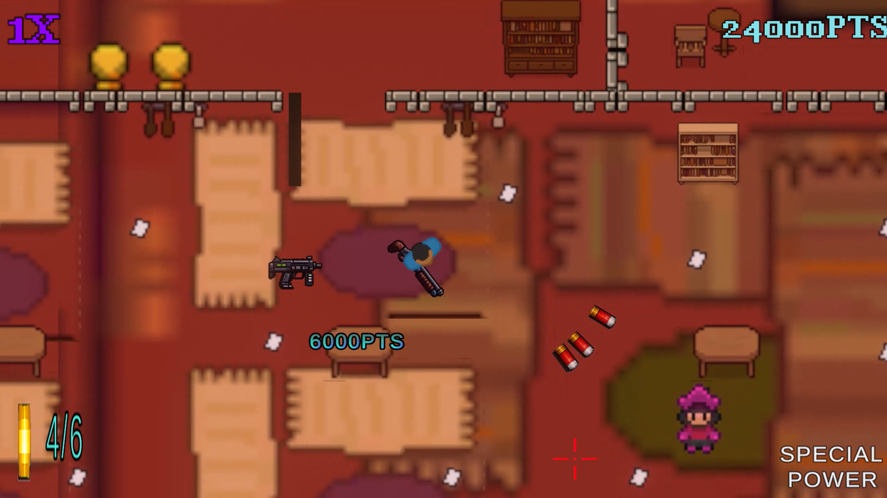
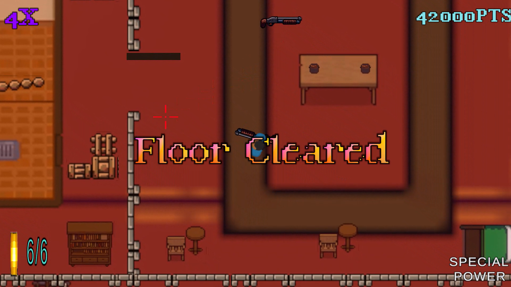
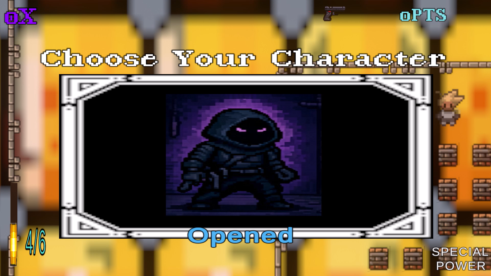
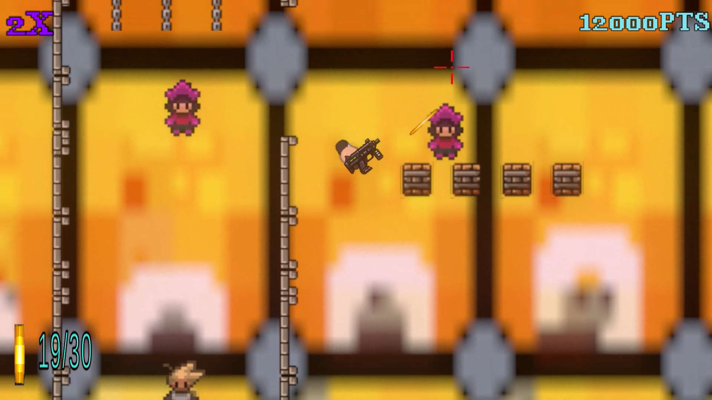
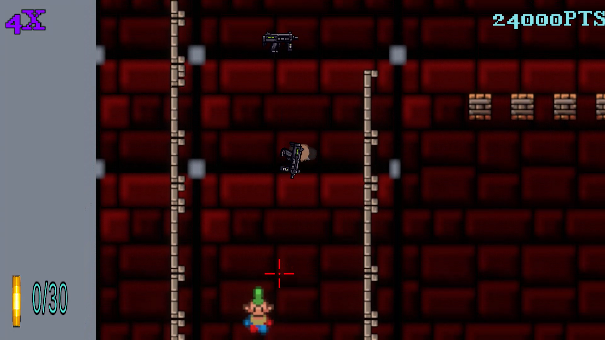

# 🎮 Corporation Black Ops 2D

A fast-paced 2D top-down action game combining enemy-clearing combat, character progression, and level-based challenge structure. Designed with modular Unity architecture, scalable gameplay systems, and lightweight performance considerations for real-time mobile/desktop execution.

---

## 🎬 Inspired By
This project draws inspiration from **Hotline Miami 2: Wrong Number** — particularly its fast-paced top-down combat, level-based structure, and audio-driven atmosphere.

---

## 🎯 Core Gameplay Loop

- Enter a level and spawn into a controlled arena
- Eliminate all enemies to complete the stage
- Unlock new characters through progression milestones
- Navigate increasingly complex combat scenarios
- Return to character selection or continue progression loop

---

## 🧠 Core Gameplay Systems

### ⚔️ Combat & Enemy System

- Enemy AI with player detection and pursuit behavior
- Line-of-sight validation using raycast-based vision
- Obstacle-aware movement and navigation logic
- Damage-based interaction system

### 🎭 Character Selection & Unlock System

- UI-based character selection menu
- Unlockable characters tied to level progression
- Persistent selection logic across scenes
- Dynamic prefab spawning per selected character

### 🧭 Level Progression System

- Sequential level activation system
- Enemy count tracking per level
- Automatic level completion detection
- Difficulty scaling through level index

### 🔊 Audio & Feedback Systems

- Dynamic level-based music switching
- Sound effects for actions and transitions
- UI feedback for selections and state changes

---

## ⚙️ Engineering & Architecture

### 🧩 System Design

- Singleton-based `GameManager` architecture
- Modular separation between UI / gameplay / AI systems
- Event-driven level completion flow
- Scene persistence using `DontDestroyOnLoad`

### 🧠 Object Lifecycle Management

- Runtime enemy and player instantiation
- Clean respawn system on level transitions
- Controlled destruction and reset logic

### 📊 Score & Combo System

- Kill-based scoring system
- Combo multiplier with decay timer
- Floating UI feedback for score events

### 🧭 Difficulty & Progression Model

- Linear level scaling system
- Character unlock milestones at specific levels
- Controlled progression pacing via level index

---

## 🚀 Performance Considerations

- Lightweight 2D physics interactions
- Avoidance of unnecessary per-frame allocations
- Cached UI references via tagged lookups
- Simple AI raycasting instead of heavy pathfinding systems

---

## 🛠️ Tech Stack

- Engine: Unity (2D)
- Language: C#
- Architecture: OOP + Singleton + Modular Design
- Target Platform: PC / Mobile

---

## 📸 Screenshots

         

---

## 🎬 Gameplay Preview

  

---

## 📌 Design Goals

This project was developed to explore:

- Modular Unity gameplay architecture
- AI-driven enemy behavior in 2D space
- Level-based progression systems
- Clean separation of gameplay systems
- Scalable character unlock mechanics
- Lightweight real-time performance design

---

## 🚀 Status

- ✔ Core gameplay loop complete
- ✔ Enemy AI system implemented
- ✔ Character unlock system active
- ✔ Level progression system working
- ⏳ Ongoing polish and balancing
